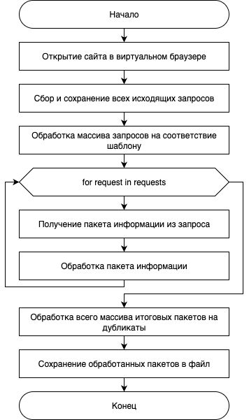

# Общее описание репозитория
В репозитории содержится программа для получения информации о текущих и запланированных матчей по eSoccer, а также для их анализа и журналирования, на базе открытого для исследования сайта https://demo.betby.com/sportsbook/classic/live/esoccer-300

Доступ к исследуемому сайту может быть осуществлен только при помощи VPN-соединения

### Установка зависимостей и запуск программ:
1. Открыть терминал в роидтельской папке проекта
2. Установить виртуальное окружение (если до этого не устанавливали):
    - python3.11 -m venv .venv (необходимо указать версию вашего Питона)
    - source <b>.venv/bin/activate</b> - для Linux, <b>.venv/Scripts/Activate</b> - для Windows
    - pip install -r requirements.txt
3. Активировать виртуальное окружение, если еще не активировали
4. Запустить нужную программу при помощи python main.py

###Структура проекта
```
├── log_stat/ - директория программы для анализа собранного лога
│   ├── logger_files/ директория с логами логгирования
│   │   ├── ...
│   ├── modules/
│   │   └── logger.py - логгирование событий
│   ├── config.json - конфигурационный файл
│   ├── main.py - основной испольняемый файл программы
├── parser/ - директория программы парсинга
│   ├── logger_files/ директория с логами логгирования
│   │   ├── ...
│   ├── modules/
│   │   ├── logger.py - логгирование событий
│   │   └── parser.py - класс парсинга данных сайта
│   ├── config.json - конфигурационный файл
│   ├── frame_example.json - пример поступающих данных в парсер
│   ├── main.py - основной исполняемый файл программы
│   └── parser_results.xlsx - результаты работы парсера
└── requirements.txt - зависимости проекта
```

## Программа парсинга
### Предназначение:
Обработка и компоновка данных, циркулирующих внутри исследуемого сайта с последующей сериализацией данных в единый формат в единый файл-журнал.

Общая схема работы программы представлена на рисунке ниже<br>


### Итог программы - файл <b>parser_results.xlsx</b> в директории программы

## Программа анализа предоставленныхх результатов
### Предназначение:
Обработка собранных данных для их дальнейшего анализа

### Итог программы:
Программа предоставляет собранные данные в виде двух объектов:
- <b>group_df</b> - объект с группированными строчками по командам, то есть в первой группе все матчи между командой_1 и командой_2 условно и т.д.
- <b>counter_df</b> - объект с рассчитанными победами и ничьими для каждой группы в каждой строчке: команда_1, команда_2, сколько раз выиграла 1 команда, сколько раз выиграла 2 команда, сколько раз была ничья
